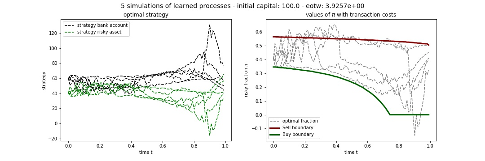

# A Deep Learning Approach to Optimal Investment With Transaction Costs

In [code](./code) you find the PyTorch implementation of the numerical method proposed in [my master's thesis](./thesis.pdf) to approximate the optimal trading strategy and the optimal risky fraction in a Black-Scholes model with transaction costs.

The results along with the trained neural networks of the experiments of Chapter 4 are provided in [results](./code/results).

To run the code and to train your own neural networks, clone this repository and execute the jupyter notebook [showcase](./code/showcase.ipynb). In the images below you see first five realizations of the approximate optimal trading strategy and the approximate optimal risky fraction

<p align="center">
  
</p>

Moreover, you find in [ItoProcesses](./code/processes/ItoProcesses.py) an implementation to simulate Brownian motion, geometric Brownian motion and the triplet of final, minimal and maximal value of scaled Brownian motion with drift. To simulate a differnet Ito process, you may define 

```python
YourProcess(Minibatch):
  def __init__(self, T=1, N=100, D=1,s0=0):
    super().__init__(T=T, N=N, D=D,s0=s0)
        
    def increment(self,M):
        #your code to specify the distribution of the increment
        return
    
    def path(self,M):
        return super().path(M)
    
    def step(self,t,x,h,dX):
        return super().step(t,x,h,dX)
    
    def drift(self,t,S):
        #your code to specify the drift function 
        return
    
    def vol(self,t,S):
        #your code to specify the volatility function 
        return 
```

and run [showcase_ItoProcesses](./code/processes/showcase_ItoProcesses.ipynb).
